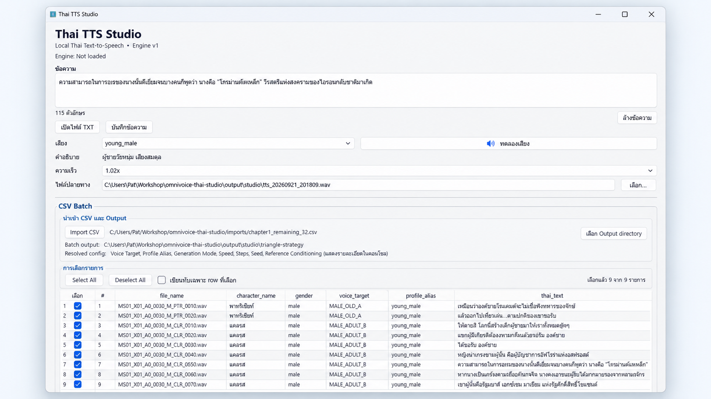

# OmniVoice Thai Studio

`OmniVoice Thai Studio` เป็น Windows desktop frontend และ tooling สำหรับงาน Thai TTS บนโมเดล `hotdogs/omnivoice-thai` โดยเน้น workflow แบบ local: พิมพ์ข้อความ, สร้าง/เล่น WAV, CSV batch, normalization, cache, checkpoint/resume และ project-aware voice configuration.



## ความสามารถหลัก

- Native desktop UI ด้วย PySide6
- Thai text normalization และ Thai-only validation ก่อนส่งเข้าโมเดล
- Voice profiles, speed, fixed seed และ generation parameters
- Lazy persistent model session ใน Studio เพื่อ reuse model ระหว่าง generation
- CSV Batch พร้อม select rows, checkpoint/resume และ watchdog สำหรับงานยาว
- Project-aware `voice_target` mapping
- รองรับ `reference_first` / reference conditioning เมื่อผู้ใช้มี reference audio ที่ได้รับสิทธิ์ใช้งานเอง
- CLI (`tts.py`) และ desktop Studio ใช้ pipeline หลักร่วมกัน

## Public repository policy

Repository สาธารณะตั้งใจเก็บ **source code, tests, configuration examples และ provenance metadata** เท่านั้น โดยไม่แจกไฟล์ต่อไปนี้:

- generated WAV / runtime output
- generated/local voice-reference audio packs นอก `assets/triangle-strategy/`
- candidate/audition audio ที่ไม่ได้อยู่ใน approved public set
- game dialogue CSV จริง
- generated chapter audio หรือ game assets

ไฟล์เหล่านี้ถูกเก็บ local และถูก ignore ด้วย `.gitignore`. ตัวอย่าง CSV ที่ไม่มีเนื้อหาเกมอยู่ที่ `imports/example_batch.csv`.

## เริ่มใช้งานบน Windows

สร้าง/เปิด virtual environment และติดตั้ง dependency:

```powershell
python -m venv .venv
.\.venv\Scripts\Activate.ps1
pip install -r requirements.txt
```

เปิด Studio:

```powershell
python studio.py
```

หรือใช้ launcher:

```text
Start OmniVoice Studio.bat
```

โมเดลจะถูกโหลดเมื่อจำเป็น ไม่ได้โหลดทันทีตอนเปิดหน้าต่าง Studio.

## CLI

ดู voice aliases:

```powershell
python tts.py --list-voices
```

สร้างเสียง:

```powershell
python tts.py --text "คืนนี้ฝนตกหนักกว่าทุกคืน" --voice bright_female --output output\sample.wav
```

ตรวจ normalization โดยไม่สร้างเสียง:

```powershell
python tts.py --text "เวลา 02:17" --voice bright_female --dry-run --show-normalized
```

ใช้ `--force` เมื่อต้องการสร้างใหม่แม้ cache key เดิมจะตรงกัน.

## CSV Batch

ตัวอย่าง schema อยู่ที่:

```text
imports/example_batch.csv
```

Studio สามารถ import CSV, เลือกเฉพาะบาง row, กำหนด output directory และสร้าง batch job ได้โดยตรง. เมื่อนำเข้า CSV ใหม่ Studio จะใช้ `<โฟลเดอร์ CSV>\\input_wav` เป็นค่าเริ่มต้นและข้าม WAV ที่มีอยู่แล้ว.

### คู่มือใช้งาน CSV Batch ผ่าน CLI / CMD

เปิด Command Prompt แล้วเข้าโฟลเดอร์โปรเจกต์ก่อน:

```bat
cd C:\\Users\\Pat\\Workshop\\omnivoice-thai-studio
```

จากนั้นสั่ง generate จากไฟล์ CSV ด้วย wrapper `omnivoice_csv.cmd`:

```bat
omnivoice_csv.cmd "C:\\path\\to\\chapter1_omnivoice_studio.csv"
```

ตัวอย่างกับ Triangle Strategy:

```bat
omnivoice_csv.cmd "C:\\Users\\Pat\\Workshop\\triangle-strategy-thai-voice\\work\\chapter1_voice_mapping\\chapter1_omnivoice_studio.csv"
```

CLI ใช้ resolver, `voice_target_map`, persistent model session, checkpoint/recovery และ policy เดียวกับ Studio. ค่าเริ่มต้นจะสร้างไฟล์ WAV ในโฟลเดอร์ `input_wav` ที่อยู่ข้างไฟล์ CSV:

```text
<โฟลเดอร์ CSV>\\input_wav
```

ถ้ายังไม่มี `input_wav` ระบบจะสร้างให้อัตโนมัติ. ก่อนเริ่ม generate ระบบจะตรวจชื่อไฟล์ใน `input_wav` โดยตรง; WAV ที่มีอยู่แล้วจะถูกนับเป็น `existing` และข้ามโดยอัตโนมัติ จึงสามารถ copy ไฟล์ที่สร้างไว้ก่อนหน้าเข้ามาใน `input_wav` แล้วรันคำสั่งเดิมเพื่อทำต่อได้ โดยไม่ต้องอาศัยประวัติ mission เก่า.

ตัวอย่าง summary ก่อนเริ่มงาน:

```text
Rows: total=323 selected=234 existing=89 errors=0
```

หมายถึง CSV มี 323 แถว, พบ WAV เดิมแล้ว 89 ไฟล์ และเหลือ generate อีก 234 ไฟล์.

เมื่อแต่ละไฟล์สร้างสำเร็จ CMD จะแสดง progress หนึ่งบรรทัดต่อไฟล์ โดยตัวเลข progress อ้างอิงเฉพาะแถวที่ถูกเลือกให้ generate ใน job รอบนั้น เช่นถ้า `selected=234` จะเริ่มจาก `[1/234]`:

```text
[18:10:27] [1/234] DONE MS01_X01_....wav | elapsed 4m 52s
```

ถ้าต้องการสร้าง WAV ที่มีอยู่แล้วทับใหม่ทั้งหมด ใช้ `--overwrite`:

```bat
omnivoice_csv.cmd "C:\\path\\to\\chapter1_omnivoice_studio.csv" --overwrite
```

ถ้าต้องการกำหนด output directory เอง ใช้ `--output`:

```bat
omnivoice_csv.cmd "C:\\path\\to\\chapter1_omnivoice_studio.csv" --output "D:\\my_wav_output"
```

ระหว่างรันสามารถกด `Ctrl+C` เพื่อยกเลิก batch ได้. ตัว CLI จะสั่ง cancel mission และหยุด background worker tree ของ batch นั้นด้วย; WAV ที่สร้างเสร็จแล้วจะยังอยู่และสามารถรันคำสั่งเดิมภายหลังเพื่อทำต่อได้.

หาก batch ถูกขัดจังหวะหรือ worker หยุด ระบบมี checkpoint/recovery สำหรับ mission ภายใน และมี retry สำหรับการเขียน checkpoint บน Windows เมื่อเจอ file lock ชั่วคราว. อย่างไรก็ตาม สำหรับ CSV CLI การตัดสินใจว่าจะ generate แถวใดในรอบใหม่จะดูจาก WAV ที่มีอยู่จริงใน output directory เป็นหลัก.

สำหรับ low-level runner ที่มี job JSON อยู่แล้ว:

```powershell
.\\.venv\\Scripts\\python.exe tts_batch_runner.py run --job tts_batch_job.example.json --line-timeout 600
```

ตรวจสถานะ mission:

```powershell
.\\.venv\\Scripts\\python.exe tts_batch_runner.py status --mission-id example-13-lines
```

## Project-aware voices และ reference conditioning

โครงสร้าง project configuration อยู่ใต้ `projects/`. Project สามารถ map `voice_target` ไปยัง profile, speed, steps, seed และ reference-conditioning configuration ได้.

Public repository รวม approved voice-reference audio ภายใต้ `assets/triangle-strategy/` ตามชุดที่ใช้กับ project config ปัจจุบัน. สำหรับ reference อื่นนอกชุดนี้ ผู้ใช้ต้องเตรียมไฟล์ที่มีสิทธิ์ใช้งานเองและปรับ config ให้ชี้ไปยัง asset ของตนเอง.

## Pipeline

โดยสรุป generation path คือ:

```text
input text
→ Thai speech normalization
→ pronunciation dictionary
→ Thai-only gate
→ voice/project configuration
→ OmniVoice Thai
→ output post-processing
→ WAV
```

Studio ใช้ cache ก่อนโหลดโมเดลเมื่อทำได้ และ generation ทำใน worker thread เพื่อไม่ให้ UI ค้าง.

## ข้อจำกัด

- CPU inference ช้ากว่า CUDA อย่างมาก
- คำยืม/ชื่อเฉพาะบางคำอาจต้องเพิ่ม pronunciation rule
- คุณภาพ reference conditioning ขึ้นอยู่กับความสะอาดและความเหมาะสมของ reference audio
- ผู้ใช้ต้องตรวจสิทธิ์/license ของ reference audio และ dataset ที่นำมาใช้เอง

## Third-party licenses

โมเดลและ dataset ภายนอกมี license ของเจ้าของแต่ละแหล่ง ดูรายละเอียดและ attribution notes ที่ [THIRD_PARTY_LICENSES.md](THIRD_PARTY_LICENSES.md).

โดยเฉพาะ public repo นี้ไม่ redistribute model weights, generated game audio หรือ game dialogue CSV; approved voice-reference assets ที่อยู่ใต้ `assets/triangle-strategy/` รวมอยู่ใน public repo และยังอยู่ภายใต้เงื่อนไข license/provenance ของแต่ละแหล่ง.

## Development

รันชุดทดสอบที่เกี่ยวข้องด้วย Python `unittest` ตามไฟล์ `test_*.py`. โปรเจกต์มี tests ครอบคลุม Studio startup, CSV batch, runtime adapter, normalization, cache และ reference-first configuration.

## License`r`n`r`nSource code ใน repository นี้เผยแพร่ภายใต้ [MIT License](LICENSE). Third-party models, datasets และ assets ไม่ได้อยู่ภายใต้ MIT โดยอัตโนมัติ; ให้ยึด license ของแต่ละแหล่งตาม [THIRD_PARTY_LICENSES.md](THIRD_PARTY_LICENSES.md).
