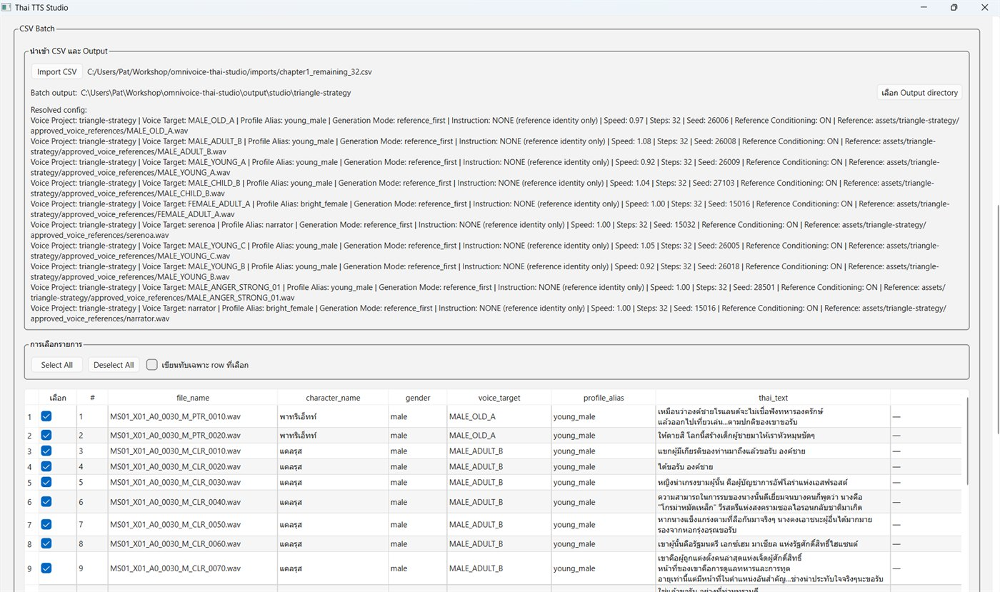

# Thai TTS Engine v1

# Thai TTS Studio

`Thai TTS Studio` เป็น native Windows desktop frontend ของ Engine v1 เดิม ไม่ได้สร้างหรือเปลี่ยน TTS pipeline ใหม่

## Screenshot



```powershell
.\.venv\Scripts\Activate.ps1
python studio.py
```

ภายใน Studio สามารถพิมพ์ข้อความ, เลือกเสียง, ปรับ speed, ตรวจ normalization และ Thai-only gate, สร้าง/เล่น WAV, เลือกที่บันทึก WAV และเปิดหรือบันทึกไฟล์ TXT แบบ UTF-8 ได้ ค่าเสียง, speed, output directory และขนาดหน้าต่างจะถูกจำด้วย `QSettings` โดยไม่เก็บข้อความหรือเสียง

Studio เรียก `tts.py` ผ่าน adapter เดิม จึงใช้ model, pronunciation dictionary, normalization, Thai-only gate, cache และ report เดียวกับ Engine v1. การสร้างเสียงทำใน worker thread เพื่อไม่ให้หน้าต่างค้าง

Studio v1.1 ใช้ lazy persistent model session: จะตรวจ cache ก่อนโหลด model, โหลด model เฉพาะ cache miss ครั้งแรก และ reuse instance เดิมสำหรับ generation ถัดไปใน Studio process เดียวกัน. CLI `tts.py` ยังทำงานแบบ process ต่อ command ตามเดิม. Voice profile ทุกตัวมี fixed seed ใน registry แล้ว และ long-text path ใช้ seed ของ profile เดียวกันผ่าน adapter เพื่อช่วยคง voice identity ระหว่าง chunk; explicit seed ยัง override ได้เมื่อจำเป็น. ไม่มีการเพิ่มระบบ cache ใหม่ใน Studio และยังไม่มี emotion control, multi-speaker หรือ game integration

โครงการนี้เป็น Thai TTS Engine v1 แบบ local CLI ใช้ pretrained model `hotdogs/omnivoice-thai` ที่ revision `252d5f2815a5d7300c7676422bee69141c7756de` เท่านั้น ไม่มีการ train, fine-tune, reference audio หรือ voice cloning และยังไม่มีการเชื่อมต่อหรือแก้ไขไฟล์เกม

## เริ่มใช้งาน

เปิด virtual environment บน Windows:

```powershell
.\.venv\Scripts\Activate.ps1
```

ดู voice aliases โดยไม่โหลด model:

```powershell
python tts.py --list-voices
```

สร้างเสียงจากข้อความ:

```powershell
python tts.py --text "คืนนี้ฝนตกหนักกว่าทุกคืน" --voice bright_female --output output\sample.wav
```

สร้างเสียงจากไฟล์ข้อความ UTF-8 เป็น WAV เดียว:

```powershell
python tts.py --text-file chapter01.txt --voice narrator --output output\chapter01.wav
```

ตรวจ pipeline โดยไม่โหลด model และไม่สร้าง WAV:

```powershell
python tts.py --text "เวลา 02:17" --voice bright_female --dry-run --show-normalized
```

`--show-normalized` จะแสดงข้อความต้นฉบับ, ข้อความหลัง normalization, dictionary substitutions และผล Thai-only gate. ใช้ `--speed` เพื่อ override ความเร็วของ profile ได้ โดยเฉพาะ `narrator` ซึ่งยังไม่เลือกความเร็วสุดท้ายจาก human listening test:

```powershell
python tts.py --text "แสงสุดท้ายของวันค่อย ๆ จางหายไปหลังแนวเขา" --voice narrator --speed 1.06 --output output\narrator.wav
```

ใช้ `--force` เมื่อต้องการสร้าง WAV ใหม่แม้ค่า cache key ตรงกัน

## Batch runner สำหรับงานหลายบรรทัด

สำหรับงานหลายบรรทัดที่อาจใช้เวลานาน ให้เรียก `tts_batch_runner.py` แทนการยิง `tts.py` หลาย process พร้อมกัน ตัว runner จะทำทีละบรรทัดด้วย worker เดียว, ใช้ lock กันงานซ้ำ, checkpoint/resume และ watchdog timeout ต่อบรรทัด

ตัวอย่าง job ดูที่ `tts_batch_job.example.json`

```powershell
.\.venv\Scripts\python.exe tts_batch_runner.py run --job tts_batch_job.example.json --line-timeout 600
```

ถ้าตัว caller เช่น Serena timeout แต่ process ยังทำงานอยู่ ให้เช็กก่อน ห้ามยิงซ้ำทันที:

```powershell
.\.venv\Scripts\python.exe tts_batch_runner.py status --mission-id example-13-lines
```

หากต้องหยุด ให้ kill เฉพาะ process tree ของ mission:

```powershell
.\.venv\Scripts\python.exe tts_batch_runner.py cancel --mission-id example-13-lines
```

รันคำสั่ง `run` เดิมอีกครั้งเพื่อ resume เฉพาะบรรทัดที่ยังไม่เสร็จ บรรทัดที่ checkpoint ยืนยันแล้วจะถูกข้าม และ output แต่ละบรรทัดจะเขียนผ่าน `.part` ก่อน atomic rename เพื่อลดไฟล์ครึ่งงานจาก timeout/crash

## Pipeline และ cache

ทุก generation ใช้ลำดับ `input text → Thai speech normalizer → pronunciation dictionary → Thai-only gate → voice profile → OmniVoice → peak -1 dBFS normalization → WAV PCM_16 24 kHz`.

หากข้อความที่พร้อมพูด, model, revision, voice instruction, speed, steps, sample rate และ audio normalization ตรงกับรายงานเดิม พร้อมมี WAV ที่ output เดิมอยู่ ระบบจะแสดง `CACHE HIT` และไม่สร้างซ้ำ. รายงาน production อยู่ที่ `output/tts_report.json`; รายงานของ Mission เดิมจะไม่ถูกแก้ไข

## ข้อจำกัดที่ทราบ

- ห้ามส่ง raw Latin text เข้า model โดยตรง; ต้องเพิ่ม normalization rule หรือ pronunciation dictionary ก่อน
- Arabic digits ต้องถูก normalize เป็นรูปแบบคำพูดภาษาไทยก่อนผ่าน gate
- loanword บางคำยังมี foreign accent และต้องเพิ่ม dictionary หลัง human listening test
- ไม่มี native emotion parameter และ personality control จำกัดตาม runtime tags
- CPU inference ช้าเมื่อไม่มี CUDA GPU
- `narrator` ยัง tune speed ได้ เพราะยังไม่มี final human speed winner
- ชื่อเกมหรือคำเฉพาะอาจต้องเพิ่ม pronunciation dictionary ภายหลัง

# OmniVoice Thai POC

POC นี้สร้างเสียงภาษาไทยด้วยโมเดล pretrained `hotdogs/omnivoice-thai` บนเครื่อง local เท่านั้น ไม่มีการ train, fine-tune, ใช้ไฟล์เกม หรือ clone เสียงบุคคลจริง

## เริ่มใช้งาน

```powershell
.\.venv\Scripts\python.exe generate_tts.py --text "ข้อความภาษาไทย" --output output\sample.wav
```

ค่ามาตรฐานใช้ `male, middle-aged, low pitch` ซึ่งเป็นชุด voice-design tags ที่ runtime รองรับสำหรับผู้ชายวัยประมาณ 30–40 ปี โทนลึกเล็กน้อย. ความนิ่งและจังหวะเล่าเรื่องควบคุมได้ทางอ้อมด้วย `--speed`.

```powershell
.\.venv\Scripts\python.exe generate_tts.py `
  --text "ข้อความภาษาไทย" `
  --output output\narrator_01.wav `
  --voice "male, middle-aged, low pitch" `
  --speed 0.94 --steps 32
```

ตัวเลือก `--voice`, `--speaker` และ `--style` รับ voice-design tags ของ OmniVoice เช่น `male`, `middle-aged`, `young adult`, `low pitch`, `very low pitch`, `moderate pitch` และ `whisper`. คำที่ runtime ไม่รองรับ (เช่น `calm`/`storytelling`) จะถูกข้ามและบันทึก warning แทนการทำให้งานล้ม. `--speed` กำหนดอัตราการพูด และ `--steps` ควบคุม diffusion quality/เวลา. สคริปต์ normalize peak เป็น -1 dBFS และเขียน WAV PCM 16-bit 24 kHz.

## Cache และรายงาน

หากข้อความ, โมเดล, revision, voice/style และ generation parameters เหมือนเดิม พร้อมมีไฟล์ output อยู่ สคริปต์จะข้ามงานและแสดง `CACHE HIT`. ใช้ `--force` เมื่อต้องการสร้างใหม่

`output/report.json` บันทึก model, revision, instruction, parameters, sample rate, duration, เวลา generate, device และ warnings/errors ของแต่ละงาน

`--reference-audio` ถูกสงวนไว้ แต่ตั้งใจปิดใน POC นี้เพื่อไม่ให้เกิด voice cloning. POC นี้ใช้ voice design เท่านั้น.

## ข้อสังเกต

รุ่น Thai ถูก fine-tune จาก OmniVoice ด้วยข้อมูลจำกัดและผู้พูด 2 คน ดังนั้นคุณภาพ/ความนิ่งของ voice design ต้องประเมินจากไฟล์จริงก่อนนำไปใช้ในงานเกมจำนวนมาก. ถ้า CUDA ใช้งานไม่ได้ ระบบยังทำงานบน CPU ได้ แต่ช้ากว่าอย่างมาก.
